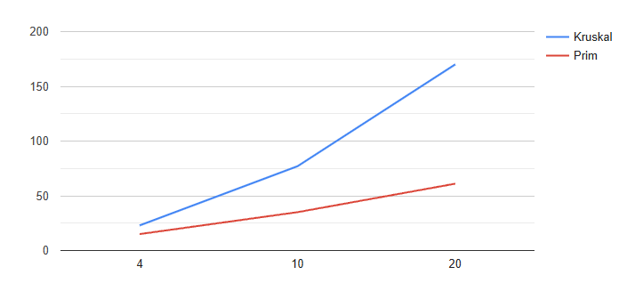
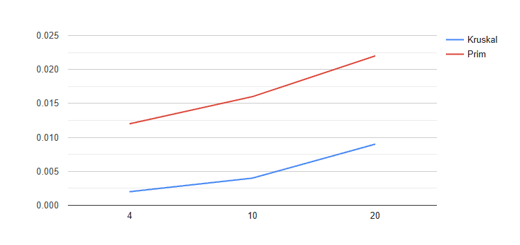
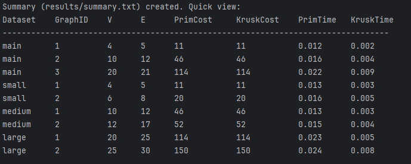

# Minimum Spanning Tree Analysis Report
**Algorithms:** Prim vs. Kruskal  
**Project:** MST Performance Evaluation  
**Student:** **Almukhamedov Temirlan**

---

## 1. Introduction
This report analyzes the performance of two Minimum Spanning Tree (MST) algorithms: **Prim’s Algorithm** and **Kruskal’s Algorithm**.  
The goal is to compare their efficiency on different graph datasets using:
- Total MST cost
- Average execution time (ms)
- Average number of operations

All tests were performed on four datasets of different sizes: **Main**, **Small**, **Medium**, and **Large**. Each graph was processed multiple times, and average values were recorded.

---

## 2. Input Data Overview
The input consists of four datasets with increasing graph sizes:

| Dataset | Graph Count | Vertices Range | Edges Range |
|---------|------------|----------------|-------------|
| Main    | 3          | 4–20           | 5–21        |
| Small   | 2          | 4–6            | 5–8         |
| Medium  | 2          | 10–12          | 12–17       |
| Large   | 2          | 20–25          | 25–30       |

---

## 3. Results and Analysis

### 3.1 Main Dataset

| Graph ID | Vertices | Edges | Prim Cost | Kruskal Cost | Avg Time P (ms) | Avg Time K (ms) | Ops P | Ops K |
|----------|----------|-------|-----------|--------------|----------------|----------------|--------|--------|
| 1 | 4  | 5  | 11  | 11  | 0.012 | 0.002 | 15 | 23 |
| 2 | 10 | 12 | 46  | 46  | 0.016 | 0.004 | 35 | 77 |
| 3 | 20 | 21 | 114 | 114 | 0.022 | 0.009 | 61 | 170 |

### 3.2 Small Dataset

| Graph ID | Vertices | Edges | Prim Cost | Kruskal Cost | Avg Time P (ms) | Avg Time K (ms) | Ops P | Ops K |
|----------|----------|-------|-----------|--------------|----------------|----------------|--------|--------|
| 1 | 4 | 5 | 11 | 11 | 0.013 | 0.003 | 15 | 23 |
| 2 | 6 | 8 | 20 | 20 | 0.016 | 0.005 | 22 | 41 |

### 3.3 Medium Dataset

| Graph ID | Vertices | Edges | Prim Cost | Kruskal Cost | Avg Time P (ms) | Avg Time K (ms) | Ops P | Ops K |
|----------|----------|-------|-----------|--------------|----------------|----------------|--------|--------|
| 1 | 10 | 12 | 46 | 46 | 0.013 | 0.003 | 35 | 77 |
| 2 | 12 | 17 | 52 | 52 | 0.015 | 0.004 | 49 | 99 |

### 3.4 Large Dataset

| Graph ID | Vertices | Edges | Prim Cost | Kruskal Cost | Avg Time P (ms) | Avg Time K (ms) | Ops P | Ops K |
|----------|----------|-------|-----------|--------------|----------------|----------------|--------|--------|
| 1 | 20 | 25 | 114 | 114 | 0.023 | 0.005 | 71 | 175 |
| 2 | 25 | 30 | 150 | 150 | 0.024 | 0.008 | 88 | 219 |

---

## 4. Comparison: Theory vs Practice

| Factor | Prim | Kruskal |
|--------|------|---------|
| Uses | Good for dense graphs | Good for sparse graphs |
| Data structures | Priority Queue | Sorting edges + Union-Find |
| Practical speed | Slower for small graphs | Very fast for small graphs |
| Operation count | Lower operations | Higher operations |
| Memory | Requires adjacency structure | Requires sorting space |

**Observation:**  
Kruskal was faster in execution time for all graphs. However, it required more operations, especially in larger datasets. Prim grows more steadily and keeps operations lower.

---

## 5. Graphs

**Operation Count Comparison**

**Difference in execution time**

Speedup: 6 times 4 times 2.4 times
        
## 6. Conclusions

Both algorithms return the same MST cost (correctness verified).  
**Kruskal is faster** on small and medium graphs due to quick sorting and fewer repeating checks.  
**Prim is more stable** in operation count, especially in larger graphs with many edges.  
For **dense graphs**, Prim may become more efficient.  
For **sparse graphs**, Kruskal is often preferable.  
Prim is good when a starting node is needed or adjacency list exists.  
Kruskal is easy when all edges are already known.

---

## 7. References
1. “Prim’s Algorithm” – GeeksforGeeks
2. “Kruskal’s Algorithm” – GeeksforGeeks
3. https://en.wikipedia.org/wiki/Minimum_spanning_tree

---

